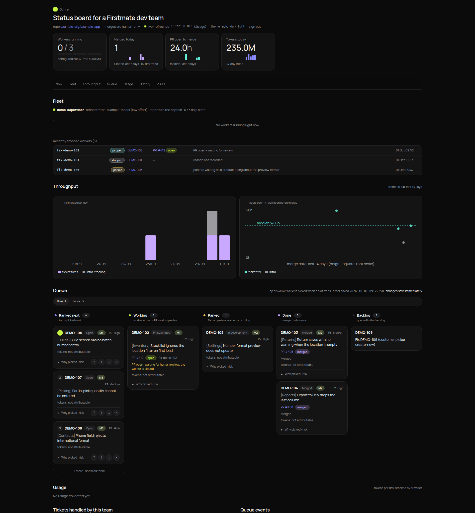

# Ochre

Ochre is a live, self-hosted status board for a Firstmate dev team. Firstmate is a supervisor that runs a fleet of AI coding agents ("workers") fixing tickets and shipping pull requests.

The board is a single static HTML page regenerated by a small Python script (standard library only, no model calls). It shows what every worker is doing right now, what is waiting on a human, what shipped, and how much it cost.



## Features

- **Now band** - workers running against the slot cap, PRs merged today, PR open-to-merge time and tokens today, each with a 14-day sparkline.
- **Fleet** - one card per live worker with a status pill (moving states animate), its ticket and PR, the latest plain-language note, the stop reason, and a 9-step validation-pipeline strip with per-step durations and findings on hover. Stopped workers collapse into a table.
- **Throughput** - PRs merged per day (ticket fixes vs infra) and hours each PR was open before merge, with the median.
- **Queue** - ranked candidates, working, parked, done and backlog lanes as a board or a table; reorder controls write through the API.
- **Usage** - tokens per day per provider and the top tickets by tokens.
- **Rules / history** - the team's synced working rules, resource-gate decisions and logs.
- **DB-change flag** - an amber tag on any worker whose branch adds a database migration.
- Live refresh every 15 seconds in the browser, light/dark themes, works at phone width.

## Quick start (fake data)

```sh
python3 sample/make_sample.py          # writes a fake Firstmate home to sample/home
python3 board/generate.py --fast       # renders out/index.html from it
```

Open `out/index.html` in a browser. Everything in the sample (tickets `DEMO-1xx`, repo, PRs, people) is invented.
If your shell exports `FM_HOME`, unset it first or the generator reads that home instead.

## Pointing it at a real Firstmate home

1. Copy `config.example.toml` to `config.toml` and fill it in (or set the matching `BOARD_*` environment variables). It names the home (`fm_home`), output file, ticket key prefix, GitHub repo and agent login, Jira site and transition ids, and the focus milestones.
2. Put secrets in `<fm_home>/.env` (see `.env.example`): `JIRA_SITE`, `JIRA_EMAIL`, `JIRA_API_TOKEN`, and `SLACK_TOKEN` for the rules sync.
3. For the sign-in page, create `<fm_home>/config/board-password` (a line `password=...`) and `<fm_home>/config/board-session-secret` (random bytes).
4. Install the units in `deploy/` (full refresh every 2 minutes, live refresh every 30 seconds, the loopback API, the rules sync) and the `deploy/nginx.conf` front, replacing the `/path/to/...` placeholders.

Requirements: Python 3.9+, `gh` (authenticated) for PR data, and `no-mistakes` on the PATH for the pipeline strip. Both are optional - the board says which source it could not read instead of failing.

## What it reads from a Firstmate home

| Source | Used for |
|---|---|
| `bin/fm-fleet-snapshot.sh --json` (or `data/board/fleet-snapshot.json`) | workers, their kind, branch and last status event |
| `bin/fm-tasks-axi.sh list --state queued` (or `data/board/backlog.txt`) | the Backlog lane |
| `state/<task>.meta`, `state/<task>.status` | worktree, model, PR link, status history and stop reasons |
| running `pi` / `claude` processes and their working directories | which workers are live right now |
| `no-mistakes axi status` in each live worktree | the pipeline-steps strip |
| `data/board/queue.json`, `fleet.json`, `worker-notes.json`, `cap.json`, `tmp.json` | queue, slot cap, notes, resource gate |
| `gh pr list` for the configured repo and author (cached in `data/board/prs.json`) | PR states, throughput and cycle time |
| `data/board/usage.json` (written by `board/usage.py` from local agent session logs) | usage charts |
| `data/<rules_dir>/` and `data/<rules_sync_dir>/README.md` | the Rules section |

## Ops scripts

- `ops/cap_gate.py` - effective worker cap with automatic memory fallback; pauses a non-focus worker when memory or `/tmp` runs low.
- `ops/orphan_check.py` - finds (and with `--kill` reaps) leaked browsers, dev servers and stale temp folders.
- `ops/jira_pr_sync.py` - moves a ticket to PR Submitted when its PR opens, to Merged when a merge bot skipped it, and keeps PR titles key-first.
- `rules_sync/sync.py` - pulls Slack canvases holding the team's rules into Markdown with version tracking.

## Licence

MIT - see `LICENSE`.
